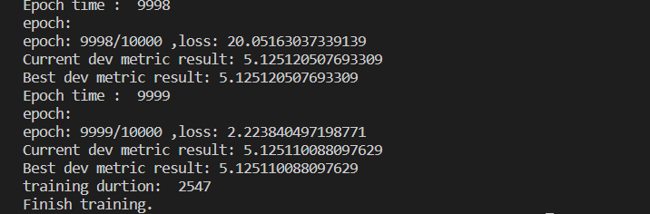

## <center> 华东师范大学数据科学与工程学院实验报告
### 2022本科生数据科学与工程算法基础实践作业（二）

| **课程名称：数据科学与工程算法基础** |**年级** ：2020级 |**上机实践成绩**： |
| --- | --- | --- |
| **指导教师** ：高明 | **姓名** ：杨舜 | **学号** ：10205501415 |
| **上机实践名称** ：基于矩阵分解的推荐系统 ||**上机实践日期**：2022.12.1 |
| **上机实践编号** ： | **组号 ：** |**上机实践时间**：2022.12.1 |

## 一、背景
在信息化和大数据的时代，如何精准地挖掘出用户的偏好是一个老生常谈的问题。推荐系统是解决此类问题的一个研究主题。本次实践作业关于如何使用矩阵分解技术解决推荐问题。

### 问题定义
给定一个用户评分矩阵 $\mathbf{R}\in\mathbb{R}^{m\times n}$，其中$m$为用户（user）的数量，$n$为物品（item）的数量。矩阵元素$r_{ij}\in\mathbf{R}$表示用户$u_i$为物品$v_j$的评分值。任务目标有两个：
- 通过矩阵分解和凸优化技术，获得每个用户$u_i$和物品$v_j$的隐式向量，分别记作$\mathbf{u}_i\in\mathbb{R}^{k}$和$\mathbf{v}_i\in\mathbb{R}^{k}$，其中$k$为向量维度；所有用户和物品分别组成矩阵$\mathbf{P}\in\mathbb{R}^{m\times k}$和$\mathbf{Q}\in\mathbb{R}^{n\times k}$；
- 根据获得的用户和物品向量，预测该用户对某个物品的偏好程度$\hat{r}_{ij}=\mathbf{u}_i\mathbf{v}_i^{T}$；

因为在实际应用中，这个用户评分矩阵式稀疏的。例如某电影网站一共有100
k用户和10k部电影，有一些用户可能只看不超过10部电影，或者有些的电影可能被观影的人数很少。换句话说，这个用户评分矩阵存在大量的缺失值，因此通过矩阵分解可以先挖掘出已存在的用户行为，再预测这些缺失值。

## 实验介绍

### 数据集介绍
课程选取了电影评分数据集，包括约20k用户和10k物品。总共有超过240k评分数据。根据评分数据划分了训练集（237k评分数据）、验证集（10k评分数据）和测试集（50k评分数据）。
- 其中训练集和验证集中，每一条数据表示为$(u_i, v_j, r_{ij})$三元组；
- 测试集则用于评测，其只有用户和商品$(u_i, v_j)$，需要预测出他们的评分；
- 验证集和测试集中出现的所有用户和商品确保一定在训练集中存在，即不考虑冷启动问题；

```
训练集、验证集样例：
userId,movieId,rating
7795,4577,5.0
7795,2972,4.0
7795,319,5.0

测试集样例：
ID,userId,movieId
0,5973,32
1,18832,4085
```

### 作业要求
实现矩阵分解推荐系统项目，包括数据读取、模型训练、优化算法、模型验证与测试；
- 实现随机梯度下降和批量梯度下降算法，完成$\mathbf{P}$和$\mathbf{Q}$矩阵的参数更新；
- 进一步优化算法，包括正则化、偏置项和协同过滤；
- 鼓励使用或自研其他算法技术来进一步提升矩阵分解的泛化性能；

## 实验过程
### 项目框架设计
```
DaSERecSys
  |-- main.py                       项目入口
  |-- RecModel.py                   推荐模型
  |-- read_dataset.py               数据矩阵输入
  |-- script
        |-- run.sh                  bash启动项目
```

### 实验思路
1. 对于读入的数据，其记录了某个用户对于某部电影的评分
2. 依据此数据分组可以分别获取到一位用户其评价了的电影以及对应的评分，一场电影评价了它的所有用户以及对应的所有评分，在用户中只有19694个用户对于至少一部电影进行的评分，电影中只有10330部电影有至少一位用户对其进行了评分，说明对于以上的用户和电影中并没有每一位用户都对于所以电影的电影进行过评分，而我们需要做的就是将上述的缺失的评分矩阵（19694*10330）进行预测补全
3. 利用上一步分组得到的数据生成用户矩阵P(19694 $*$ hidden_size),电影矩阵Q(10330 $*$ hidden_size)，矩阵的初始化可以有多种方法，例如正态分布，全0矩阵，全1矩阵，本次实验中采用矩阵归一化生成，即矩阵满足正态分布
```python
P = dict(zip(
            self.users_ratings.index,
            np.random.randn(len(self.users_ratings), self.hidden_size).astype(np.float32)
        ))
        # Item-LF
        Q = dict(zip(
            self.items_ratings.index,
            np.random.randn(len(self.items_ratings), self.hidden_size).astype(np.float32)
        ))
        return P, Q
```
4. 对于初始化的矩阵将其带入迭代训练，将估计的矩阵与真实值的均方误差作为损失函数来进行目标函数优化
```python
def loss(ground_truth, prediction):
        truth = np.array(ground_truth)
        pred = np.array(prediction)
        tmp = truth-pred
        loss = tmp.dot(tmp.T)
        return loss
```
5. 对于损失函数，加入正则项(本项目中采用L2正则项)，以对参数进行约束
   - 损失函数 $Loss = E_{ij}^2 = (r_{ij}-\sum_{k=1}^K{p_{ik}q_{kj}})^2$ 
   - 加入正则项 $Loss = E_{ij}^2 = (r_{ij}-\sum_{k=1}^K{p_{ik}q_{kj}})^2+\frac{\beta}{2}\sum_{k=1}^K{(p_{ik}^2+q_{kj}^2)}$
6. 修改上述loss函数计算,为其添加正则化项
```python
def loss_norm(self,ground_truth, prediction, P, Q):
        truth = np.array(ground_truth)
        pred = np.array(prediction)
        tmp = truth-pred
        loss = tmp.dot(tmp.T)
        ## 正则化项
        bias = 0
        for uid, iid, real_rating in self.dev_dataset.itertuples(index=False):
            if uid not in self.users_ratings.index or iid not in self.items_ratings.index:
                bias += 0
                continue
            p_u = P[uid]
            q_i = Q[iid]
            bias += np.dot(p_u,p_u.T)
            bias += np.dot(q_i,q_i.T)
        loss += bias
        return loss
```
7. 基于上述损失函数的表达式，得到损失函数的梯度
   - $\nabla p_{ik} = -2(r_{ij}-\sum_{k=1}^K{p_{ik}q_{kj}})q_{kj}+\beta p_{ik}$
   - $\nabla q_{kj} = -2(r_{ij}-\sum_{k=1}^K{p_{ik}q_{kj}})p_{ik}+\beta q_{kj}$
  
8. 利用上市得到首先得到批量梯度矩阵下降的算法
```python
def bgd(self, P, Q, batch_size: int=8):
        '''
        *********************************
        基本分：请实现【批量梯度下降】优化
        加分项：进一步优化如下
        - 考虑偏置项
        - 考虑正则化
        - 考虑协同过滤
        *********************************
        '''
    num_train = len(self.train_dataset)
    ## 计算按照batch_size分组需要多少组
    iterations_per_epoch = max(num_train // batch_size, 1)
    for i in range(iterations_per_epoch):
        ## 按照顺序取出batch_size个样本对P,Q进行优化
        ## train_step_dataset = self.train_dataset[i*batch_size:(i+1)*batch_size]
        # print("train_step_dataset: ",train_step_dataset)
        train_step_dataset = self.train_dataset.sample(batch_size,replace=False)
        train_loss = 0.
        prediction, ground_truth = list(), list()
        ## 得到本次迭代中选中的batch_size个样本的预测值以及对应的真实值用以计算损失函数值以及训练
        for uid, iid, real_rating in train_step_dataset.itertuples(index=False):
            prediction_rating = self.predict_user_item_rating(uid, iid, P, Q)
            # dev_loss += abs(prediction_rating - real_rating)
            prediction.append(prediction_rating)
            ground_truth.append(real_rating)
            
        ## 计算这batch_size样本的损失
        # print("prediction: ",prediction)
        # print("ground_truth: ",ground_truth)

        train_loss = self.loss_norm(ground_truth,prediction,P,Q,train_step_dataset)
        print("batch_size: {}/{}, loss : {}".format((i+1)*batch_size, num_train, train_loss))
        # print("batch_size: {}/{}".format((i+1)*batch_size, num_train))
        self.loss_history.append(train_loss)

        ## 利用batch_size样本进行梯度更新
        P,Q = self.grad_norm(P, Q, train_step_dataset)
    # print(train_loss)
    return P, Q

def grad_norm(self, P, Q, train_step_dataset):
    P_tmp = P
    Q_tmp = Q
    for uid, iid, real_rating in train_step_dataset.itertuples(index=False):
        if uid not in self.users_ratings.index or iid not in self.items_ratings.index:
            continue
        p_u = P[uid]
        q_i = Q[iid]
        p_u_tmp = P_tmp[uid]
        q_i_tmp = Q_tmp[iid]
        r_ui = np.dot(p_u,q_i.T)
        dp_u = self.reg_p*p_u-2*(real_rating-r_ui)*q_i
        dq_i = self.reg_q*q_i-2*(real_rating-r_ui)*p_u
        P_tmp[uid] = p_u_tmp-self.reg_p*dp_u
        Q_tmp[iid] = q_i_tmp-self.reg_q*dq_i
    P = P_tmp
    Q = Q_tmp
    return P, Q

```
9. 类似地，实现随机梯度下降的算法
   - 批量梯度下降：
   - - 在更新参数的过程中使用所有的样本
   - 随机梯度下降：
   - - 在更新参数的过程中仅选取一个样本
```python
def sgd(self, P, Q):
     '''
     *********************************
     基本分：请实现【批量梯度下降】优化
     加分项：进一步优化如下
     - 考虑偏置项
     - 考虑正则化
     - 考虑协同过滤
     *********************************
     '''
     num_train = len(self.train_dataset)
     mask = np.random.randint(0,num_train-1)
     # print("mask",mask)
     # print("self.train_dataset[0]",self.train_dataset[mask:mask+1])
     # exit(0)
     train_step_dataset = self.train_dataset[mask:mask+1]
     train_loss = 0.
     prediction, ground_truth = list(), list()
     for uid, iid, real_rating in train_step_dataset.itertuples(index=False):
         prediction_rating = self.predict_user_item_rating(uid, iid, P, Q)
            # dev_loss += abs(prediction_rating - real_rating)
        prediction.append(prediction_rating)
        ground_truth.append(real_rating)
    train_loss = self.loss_norm(ground_truth,prediction,P,Q,train_step_dataset)
     # print("batch_size: {}/{}, loss : {}".format((i+1)*batch_size, num_train, train_loss))
     # print("batch_size: {}/{}".format((i+1)*batch_size, num_train))
     self.loss_history.append(train_loss)
     ## 利用batch_size样本进行梯度更新
     P,Q = self.grad_norm(P, Q, train_step_dataset)
    return P, Q

```
### 实验过程
1. 首先验证批量梯度下降（BGD）的训练结果以及训练时常记录（秒）
   

2. 修改结果输出代码可视化在迭代过程中预测结果RMSE的变化（备注：因为BGD训练用时太长了所以减少了迭代的次数为10次）
   

3. 测试模型

4. 将测试结果上交至kaggle
   
5. 再次更改参数训练随机梯度下降（SGD），因为在随机梯度下降中每次只是取出一个样本对矩阵P、Q进行梯度更新，因此加大迭代次数使得模型有更高的预测结果
   
   
6. 测试随机梯度下降 
7. 将测试结果上交至kaggle

### 实验总结
推荐系统是信息过滤系统的子集，系统任务便是预测用户接下来更可能想要查看的内容，也就是将特定的信息过滤出来提交给用户。在本次的实验过程中我们利用矩阵分解的方法利用当前已有的用户对于电影的评分补全其他电影对应的评分从而进一步实现推荐推荐系统
本模型中将预测结果与实际结果的均方误差作为优化目标的损失函数，在优化的过程中分别采用了批量梯度下降方法和随机梯度下降方法进行模型的训练，对比两种不同的优化算法可以看出：
- 对于批量梯度下降：在每次迭代更新参数的过程中需要使用所有的样本，历遍所有的训练样本使得每次的迭代用时相较于SGD要高出很多，对于大样本量的训练集来说训练的用时太高，但是因为每次训练考虑的都是全部的样本，所以在迭代的过程中函数可以在较小的迭代次数内收敛
- 对于批量梯度下降：在每次迭代更新参数的过程中只需要随机抽取一个样本，少量的样本采用使得每次的迭代用时相较于BGD要少很多，但是对于大样本量的训练集来说，应为每次训练只从中采取一个样本，使得每次迭代后损失值的下降不够明显，所以在迭代的过程中函数需要多次迭代来达到收敛
- 结合上述两种梯度下降的优缺点，我们可以采取另一种梯度下降的方式min-batch GD，每次迭代过程中随机从训练集中选取batch_size数量的样本用于更新矩阵P，Q，下面附上代码
```python
def mbgd(self, P, Q, batch_size):
        
    train_step_dataset = self.train_dataset.sample(batch_size)
            # print("train_step_dataset: ",train_step_dataset)
    train_loss = 0.
    prediction, ground_truth = list(), list()
    for uid, iid, real_rating in train_step_dataset.itertuples(index=False):
        prediction_rating = self.predict_user_item_rating(uid, iid, P, Q)
        # dev_loss += abs(prediction_rating - real_rating)
        prediction.append(prediction_rating)
        ground_truth.append(real_rating)
            
    ## 计算这batch_size样本的损失
    # print("prediction: ",prediction)
    # print("ground_truth: ",ground_truth)

    train_loss = self.loss_norm(ground_truth,prediction,P,Q,train_step_dataset)
    # print("batch_size: {}/{}, loss : {}".format((i+1)*batch_size, num_train, train_loss))
            # print("batch_size: {}/{}".format((i+1)*batch_size, num_train))
    self.loss_history.append(train_loss)

    ## 利用batch_size样本进行梯度更新
    P,Q = self.grad_norm(P, Q, train_step_dataset)
    # print(train_loss)
    return P, Q
```

项目完成感悟和总结:通过本次实验，我进一步了解了基于矩阵分解的推荐算法的实现。了解了机器学习的问题分析、数学建模、代码实现、训练、验证、测试的过程。对于推荐算法有了更加清楚的认识，有了深入了解的兴趣。
